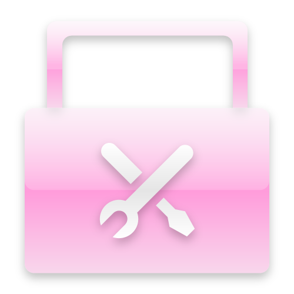

<div align="center">
    </img>
</div>
<h1 align="center">万物工具箱</h1>
<h4 align="center">一款可爱而帅气的工具箱~</h4>
<h4 align="center">支持 Windows XP、Vista、7、8、8.1、10、11</h4>
<p align="center">
  <a href="https://creativecommons.org/publicdomain/zero/1.0/">
    
  </a>
  
</p>

---

## 📖 项目简介

万物工具箱是一款集成式的 Windows 系统工具集合，主程序会自动扫描 `Tools/` 与 `GameTools/` 目录下的程序并生成工具列表，支持涵盖媒体处理、文件管理、硬件检测、系统维护、远程控制、游戏辅助等多个领域的实用工具，同时提供多套主题皮肤和音效，让工具箱既好用又好看。

> **⚠️ 重要 — 关于第三方工具的版权规避设计**
>
> 本仓库**不附带任何第三方软件的可执行文件**（FFmpeg、Everything、AIDA64、RustDesk 等所有第三方工具均不在仓库中分发）。
>
> 万物工具箱主程序采用**「目录自动扫描 + 用户自行放程序」**的机制来规避版权：
>
> 1. **主程序自己加工具** — 只要用户把第三方程序的 `.exe`（或快捷方式）放到 `Tools/` 对应分类文件夹或 `GameTools/` 目录下，主程序启动时会自动扫描目录并把它们添加到工具列表中，无需修改代码或重新打包。
> 2. **版权与责任自负** — 用户自行下载、放置的任何第三方程序，其著作权、许可协议、使用条款和法律责任均由用户自行承担，与本项目作者无关。
> 3. **CC0 协议范围** — 本协议只适用于**本仓库中的原创内容**（`万物工具箱.exe` 主程序、`Assets/` 资源、主题皮肤、音效、背景图、配置模板、更新日志、`GameTools/` 下作者自行整理的开源/免费工具等）。第三方工具程序本身不受 CC0 覆盖，其版权归各自作者所有。
> 4. **为何这样设计** — 直接打包分发第三方商业软件或有许可限制的程序会构成版权侵权，因此采用「工具箱只做外壳和资源，具体程序由用户按需自取」的方式，从根本上规避了分发版权问题。

## 🗂️ 目录结构

```
万物工具箱/
├── 万物工具箱.exe                          主程序（CC0 原创，扫描目录自动生成工具列表）
├── 工具箱配置（请勿删除，留着可以自己改哦）.ini   配置文件
├── 万物工具箱.VisualElementsManifest.xml   开始菜单磁贴清单
├── logo.png                                程序图标
├── Assets/                                 资源文件（CC0 原创：皮肤/音效/图标/背景）
│   ├── 图标/                               界面图标
│   ├── 掉下来的工具图标/                   动画图标
│   ├── 背景/                               节日背景图片
│   ├── 视频/                               动画视频
│   ├── 音效/                               各类主题音效
│   └── 颜色/                               主题皮肤（橘/粉/红/绿/青）
├── GameTools/                              游戏工具目录（用户自行放入 .exe）
│   └── 文件放这里哟.txt                    占位提示
├── Tools/                                  ⚠️ 第三方系统工具目录——用户自行放置 .exe
│   ├── 媒体工具/                           把 FFmpeg、oCam、ScreenToGif 等放这里
│   ├── 实用工具/                           把 PowerISO、ResourceHacker 等放这里
│   ├── 文件工具/                           把 Everything、FastCopy、WizTree 等放这里
│   ├── 硬件工具/                           把 AIDA64、CPU-Z、CrystalDiskInfo 等放这里
│   ├── 系统工具/                           把 Dism++、Rufus、Ventoy 等放这里
│   ├── 系统优化/                           把 WiseRegistryCleaner 等放这里
│   └── 远程控制/                           把 RustDesk、AnyDesk 等放这里
└── 更新日志/                               版本更新记录
```

> **说明**：`Tools/` 与 `GameTools/` 下的子文件夹只是分类占位，**仓库中并不包含任何第三方程序的 exe**。把你自己下载的 exe 或快捷方式丢进对应分类文件夹，启动主程序后它会**自动扫描目录并把它们加到工具菜单里**，无需任何配置。

## 🎨 主题与音效

工具箱内置多套主题皮肤（橘色、粉色、红色、绿色、青色），每套包含主窗口、按钮、进度条、选择框等全套 `.WSkin` 皮肤文件，以及多种风格的音效（Mint、Win 经典、一加、三星、小米等），让工具箱充满个性。

## 🚀 使用方法

1. 下载并解压工具箱到任意目录
2. **按需放入工具程序（规避版权关键步骤）**：
   - 打开 `Tools/` 目录下对应的分类子文件夹（如 `Tools/文件工具/`）
   - 把你自行从官方渠道下载的第三方程序 `.exe`（或其快捷方式）丢进对应文件夹
   - 也可以在 `工具箱配置.ini` 中手动指定工具路径与分类
   - **主程序启动时会自动扫描目录并把它们加入左侧工具菜单**，无需改代码、无需重新打包
3. 运行 `万物工具箱.exe` 启动主程序
4. 在主界面选择需要的工具分类，点击对应工具即可运行
5. 放在 U 盘中即可作为便携工具集使用

## 📝 更新日志

更新日志位于 `更新日志/` 目录，打开 `index.html` 即可查看版本更新记录。

---

## 📜 版权协议（CC0 1.0 通用）

本项目采用 **CC0 1.0 通用 (CC0 1.0)** 协议，自愿放弃版权。

### 自愿放弃版权声明

在法律允许的最大范围内，本作品的作者已根据 CC0 1.0 通用协议（公共领域捐赠）放弃本作品的所有版权和相关或邻近权利（包括但不限于商标权、专利权、数据库保护权等）。

您可以在任何目的下自由复制、修改、分发和表演本作品，包括商业目的，无需事先许可。

### 完整协议文本

> Creative Commons Legal Code
>
> CC0 1.0 Universal
>
> CREATIVE COMMONS CORPORATION IS NOT A LAW FIRM AND DOES NOT PROVIDE LEGAL SERVICES. DISTRIBUTION OF THIS DOCUMENT DOES NOT CREATE AN ATTORNEY-CLIENT RELATIONSHIP. CREATIVE COMMONS PROVIDES THIS INFORMATION ON AN "AS-IS" BASIS. CREATIVE COMMONS MAKES NO WARRANTIES REGARDING THE USE OF THIS DOCUMENT OR THE INFORMATION OR WORKS PROVIDED HEREUNDER, AND DISCLAIMS LIABILITY FOR DAMAGES RESULTING FROM THE USE OF THIS DOCUMENT OR THE INFORMATION OR WORKS PROVIDED HEREUNDER.
>
> **Statement of Purpose**
>
> The laws of most jurisdictions throughout the world automatically confer exclusive Copyright and Related Rights (defined below) upon the creator and subsequent owner(s) (each and all, an "owner") of an original work of authorship and/or a database (each, a "Work").
>
> Certain owners wish to permanently relinquish those rights to a Work for the purpose of contributing to a commons of creative, cultural and scientific works ("Commons") that the public can reliably and without fear of later claims of infringement build upon, modify, incorporate in other works, reuse and redistribute as freely as possible in any form whatsoever and for any purposes, including without limitation commercial purposes. These owners may contribute to the Commons to promote the ideal of a free culture and the further production of creative, cultural and scientific works, or to gain reputation or greater distribution for their Work in part through the use and efforts of others.
>
> For these and/or other purposes and motivations, and without any expectation of additional consideration or compensation, the person associating CC0 with a Work (the "Affirmer"), to the extent that he or she is an owner of Copyright and Related Rights in the Work, voluntarily elects to apply CC0 to the Work and publicly distribute the Work under its terms, with knowledge of his or her Copyright and Related Rights in the Work and the meaning and intended legal effect of CC0 on those rights.

#### 1. 版权和相关权利定义

本作品在法律上可能受限于版权和/或相关权利。版权包括但不限于以下权利：复制、改编、发行、表演、展示、传播等权利。相关权利包括但不限于表演者权、录音制品制作者权、广播组织权、数据库特殊权利等，无论其如何界定或归类。

#### 2. 权利放弃

在法律允许的最大范围内，声明人特此明确、完全、永久、不可撤销地放弃本作品的所有版权和相关权利，以及所有相关的诉讼理由，无论是现在已知的还是将来产生的，无论是否基于版权或其他原因。

#### 3. 公开许可补遗

如果上述权利放弃因任何原因在法律上无法完全生效，则本作品根据以下条款许可：

- **复制权**：可以自由复制本作品
- **改编权**：可以自由修改、改编、转换本作品
- **发行权**：可以自由发行、传播、表演、展示本作品
- **商业使用**：可以将本作品用于商业目的
- **免版税**：无需支付任何版税或费用

#### 4. 限制与免责

- 声明人不提供任何明示或暗示的担保
- 声明人不因他人使用本作品而承担任何责任
- 本放弃声明不影响其他可能保护本作品的商标或专利权
- 本放弃声明不影响其他人可能对本作品享有的权利

完整协议文本请访问：<https://creativecommons.org/publicdomain/zero/1.0/legalcode.zh-Hans>

---

<p align="center">
  <a href="https://creativecommons.org/publicdomain/zero/1.0/">
    
  </a>
  <br/>
  <sub>本作品已基于 CC0 1.0 协议自愿放弃版权，进入公共领域</sub>
</p>
